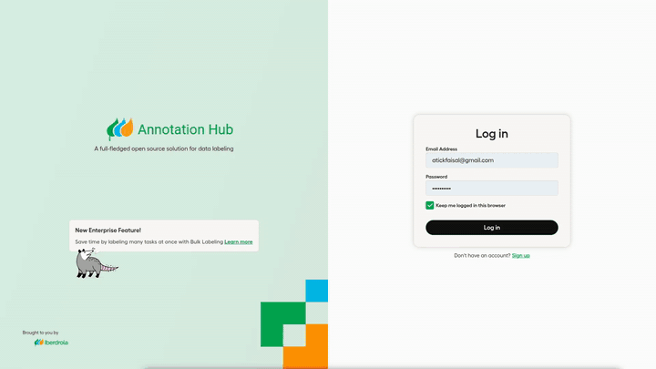

# Annotation Hub



## 0. Local Development Setup

Before making branding updates, ensure you can run the app locally and preview changes.

### Prerequisites

Install the following globally if not already available:

```bash
# Install Yarn (via npm)
npm install --global yarn

# Install Poetry (via pip)
pip install poetry
```

---

### Setup and Run the App

1. **Install Python dependencies using Poetry**
   From the project root:

    ```bash
    poetry install
    ```

2. **Apply database migrations**

    ```bash
    python label_studio/manage.py migrate
    ```

3. **Build the frontend assets**
   From the `web/` directory:

    ```bash
    cd web
    yarn install
    yarn build
    cd ..
    ```

4. **Collect static files**

    ```bash
    python label_studio/manage.py collectstatic
    ```

5. **Run the development server**

    ```bash
    python label_studio/manage.py runserver
    ```

---

### Previewing Frontend Changes

To reflect **any frontend updates** (SVGs, styles, colors, tokens, etc.), you must **rebuild and reload**:

```bash
cd web
yarn build
cd ..
python label_studio/manage.py collectstatic
python label_studio/manage.py runserver
```

Repeat these steps each time you make visual/UI-related changes.

---

### Adaptation of Label Studio with Iberdrola Branding

This guide provides clear instructions for integrating the **Iberdrola** branding into the **Label Studio** interface. It replaces visual assets, updates the theme colors, and modifies references to reflect the new identity. This document assumes you have a working Label Studio source code environment.

---

## 1. Webpage Title

**File:** `label_studio/templates/simple.html`
**Change:**

```diff
- <title>Label Studio</title>
+ <title>Annotation Hub</title>
```

---

## 2. Favicon

Replace the following files with your custom `favicon.ico` and `favicon.png`:

```bash
label_studio/core/static/images/favicon.ico
label_studio/core/static/images/favicon.png
```

---

## 3. Login Page Branding

### 3.1 Logo Replacement

Replace the Label Studio and HumanSignal logos with the **Annotation Hub** and **Iberdrola** SVGs.

**Location:**

```bash
label_studio/core/templates/login.html
```

Use the provided SVG snippets for:

-   **Annotation Hub Logo**
-   **Iberdrola Logo**

Embed these inside the appropriate `svg` containers in the login template.

---

### 3.2 Login Page Gradient

**File:** `label_studio/core/static/css/login.css`
Update the background gradient:

```diff
- background: linear-gradient(109.47deg, rgba(255, 166, 99, 0.15), ...);
+ background: linear-gradient(109.47deg, rgba(0, 166, 81, 0.15), rgba(0, 148, 72, 0.15), rgba(0, 130, 63, 0.15));
```

---

### 3.3 Background Image

Replace the background SVG in the login screen with the provided green-blue-orange pattern.

**Location:**

```bash
label_studio/core/static/images/login-bg.svg
```

Paste the new SVG into the appropriate place or overwrite the file.

---

## 4. Logo in App

**File:**

```bash
web/apps/labelstudio/src/assets/images/logo.svg
```

Replace this with the **Annotation Hub** logo SVG to update branding in the app UI.

---

## 5. Theme Colors

**File:** `web/libs/ui/src/tokens/tokens.scss`
Update the `grape`, `blueberry`, and `persimmon` color tokens with the Iberdrola palette.

```css
--color-grape-100: rgb(209 245 225);
--color-grape-200: rgb(176 237 204);
--color-grape-300: rgb(144 230 183);
--color-grape-400: rgb(96 217 151);
--color-grape-500: rgb(0 166 81);
--color-grape-600: rgb(0 148 72);
--color-grape-700: rgb(0 130 63);
--color-grape-800: rgb(0 94 46);
--color-grape-900: rgb(0 74 36);
--color-grape-950: rgb(0 30 15);
--color-grape-000: rgb(240 252 246);

--color-blueberry-100: rgb(204 246 255);
--color-blueberry-200: rgb(165 239 255);
--color-blueberry-300: rgb(125 231 255);
--color-blueberry-400: rgb(56 213 248);
--color-blueberry-500: rgb(0 184 230);
--color-blueberry-600: rgb(0 164 205);
--color-blueberry-700: rgb(0 144 180);
--color-blueberry-800: rgb(0 104 130);
--color-blueberry-900: rgb(0 82 102);
--color-blueberry-950: rgb(0 33 41);
--color-blueberry-000: rgb(240 253 255);

--color-persimmon-100: rgb(255 230 204);
--color-persimmon-200: rgb(255 213 170);
--color-persimmon-300: rgb(255 196 137);
--color-persimmon-400: rgb(255 162 70);
--color-persimmon-500: rgb(255 140 0);
--color-persimmon-600: rgb(230 126 0);
--color-persimmon-700: rgb(204 112 0);
--color-persimmon-800: rgb(153 84 0);
--color-persimmon-900: rgb(128 70 0);
--color-persimmon-950: rgb(51 28 0);
--color-persimmon-000: rgb(255 248 240);
```

---

## 6. Global Text Replacement

Replace all visible mentions of "Label Studio" with "Annotation Hub".

**Command:**

```bash
rg -l "Label Studio" | xargs sed -i 's/Label\ Studio/Annotation\ Hub/g'
```

Assuming you are on a UNIX-based system. If you are using Windows, GET HELP!

---

## ✅ Final Checklist

| Task                            | Done |
| ------------------------------- | ---- |
| Favicon replaced                | ⬜   |
| Title updated                   | ⬜   |
| Logos updated (Login & App)     | ⬜   |
| Background SVG updated          | ⬜   |
| Login gradient updated          | ⬜   |
| Color tokens updated            | ⬜   |
| "Label Studio" renamed globally | ⬜   |

## Segment Anything Backend for Annotation Hub

1. To run the SAM backend, you have to clone the repository and install all dependencies using pip:

```shell
git clone https://github.com/HumanSignal/label-studio-ml-backend.git
cd label-studio-ml-backend
pip install -e .
cd label_studio_ml/examples/segment_anything_2_image
pip install -r requirements.txt
```

2. Download [`segment-anything-2` repo](https://github.com/facebookresearch/sam2) into the root directory. Install SegmentAnything model and download checkpoints using [the official Meta documentation](https://github.com/facebookresearch/sam2?tab=readme-ov-file#installation) You should now have the following folder structure:

    | root directory | label-studio-ml-backend | label-studio-ml | examples | segment_anything_2_image | sam2 | sam2 | checkpoints

3. Then you can start the ML backend on the default port `9090`:

```shell
cd ~/sam2
label-studio-ml start ../label-studio-ml-backend/label_studio_ml/examples/segment_anything_2_image
```

Due to breaking changes from Meta [HERE](https://github.com/facebookresearch/sam2/blob/c2ec8e14a185632b0a5d8b161928ceb50197eddc/sam2/build_sam.py#L20), it is CRUCIAL that you run this command from the sam2 directory at your root directory.

4. Connect running ML backend server to Label Studio: go to your project `Settings -> Machine Learning -> Add Model` and specify `http://localhost:9090` as a URL. Read more in the official [Label Studio documentation](https://labelstud.io/guide/ml#Connect-the-model-to-Label-Studio).
